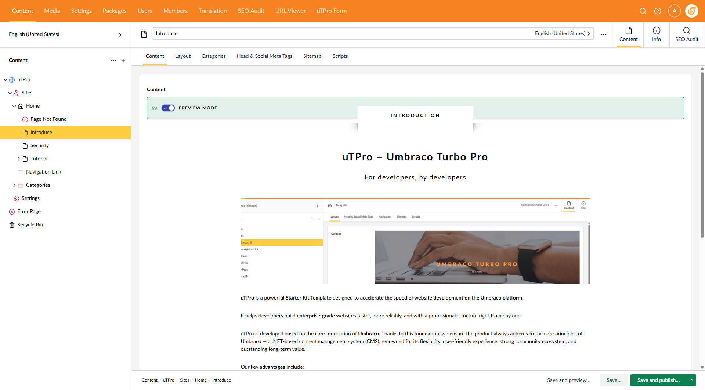
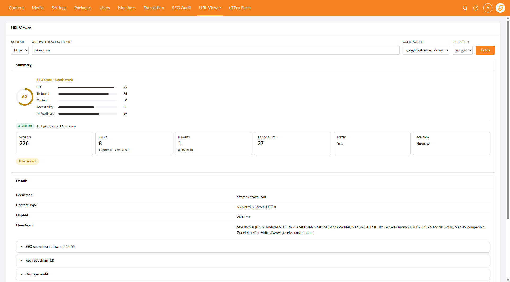
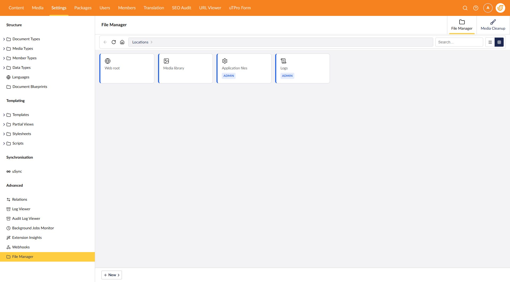
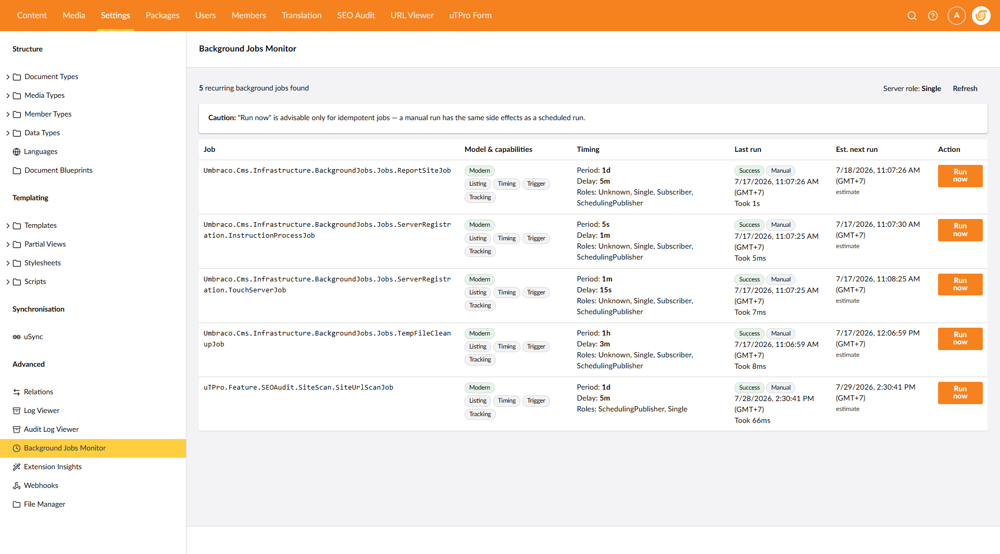
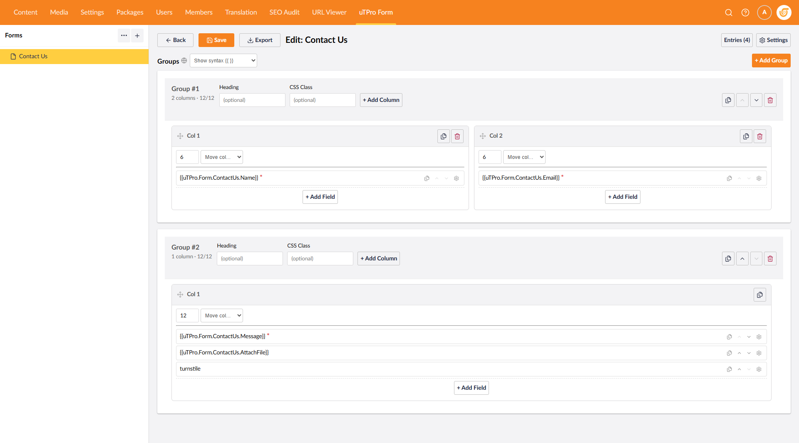

# 10. Backoffice Tools

This page covers the backoffice-facing tools bundled with or commonly added to uTPro.

## 10.1 Dashboard & Header App

The **uTPro Dashboard** (Content section → *uTPro* tab) and the **Header App** (top-right popover) ship with `uTPro.Feature.Dashboard`. They show the installed/latest version, an update check, site statistics, current-user details and recent activity/audit trail.

Full details: [6. Dashboard & Header App](6.-Dashboard).

## 10.2 Error pages

uTPro returns proper HTTP status codes for errors (no soft-404s), using `UseStatusCodePagesWithReExecute("/error/{0}")` in the pipeline ([3.5](3.-Project-Structure#35-middleware-pipeline-order)).

- **Content**: the **Page Error** node (`globalPageError`, see [8.6](8.-Global-Settings#86-error-page)) provides the 404/500 body and can be excluded from indexing.
- **Behaviour**: 404 → the not-found page (also configurable per site via the Home node's **Page Not Found** field, `pageNotFound`); server errors → the error template with a 500 status.
- The response keeps the correct status code so search engines and monitoring see the real result.

## 10.3 Block Preview

uTPro integrates [Umbraco.Community.BlockPreview](https://marketplace.umbraco.com/package/umbraco.community.blockpreview) so editors see components rendered as they'll appear on the site, directly in the Block Grid editor.

- Configured in `Startup/BlockPreviewSetup.cs` with custom view locations.
- Components can detect preview mode and render a lighter output (CSS only, no JS) via `Context.Request.IsBlockPreviewRequest()` — see [9.7](9.-Developer-Reference#97-block-preview-aware-components).
- `App_Plugins` and backoffice static assets are cached by the browser; **hard-refresh** the backoffice after editing them.

## 10.4 URL Viewer (optional package)

`uTPro.Feature.UrlViewer` is an optional standalone package that adds two Settings-section tools (both authenticated, gated to the **Settings** section, routed under `/umbraco`):

- **URL Viewer** (`utpro/url-viewer`) — fetch any URL with a custom **User-Agent** and **Referrer** to inspect the raw response. Redirects are followed manually so an SSRF guard runs on every hop.
- **Site URL Scan** (`utpro/url-scan`) — crawls the site's public URLs and stores a report of broken/error links. Supports: run a full scan in the background, re-scan only the error list, re-scan a single URL, and an on-demand **node scan** (scan one Content/Media node's URLs without persisting). A recurring background job keeps the report fresh (auto-discovered by Job Monitor if installed).

Install it only if you need link auditing; it is not part of the base solution (see [3.2](3.-Project-Structure#32-solution-architecture)).

## 10.5 Other optional packages

Add these standalone packages as needed (see [3.2](3.-Project-Structure#32-solution-architecture)):

| Package | Purpose |
|---------|---------|
| **File Manager** | Browse/edit files under configured roots from the backoffice |
| **Simple Form Builder** | Build forms (used by the Contact Form component + Turnstile — see [8.4](8.-Global-Settings#84-contact-form--cloudflare-turnstile)) |
| **Audit Log** | Extended audit logging |
| **Job Monitor** | Monitor recurring background jobs |
| **Auto Translation** | Assisted content translation |

